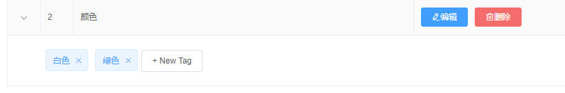
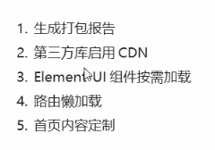

## 1.项目概述

### 功能模块


### 前后端分离的开发模式


后端写接口，前端调接口


### 技术选型


## 2.项目初始化

**前端**


**后端**


## 3.登录与退出功能

### 3.1.登录功能

#### 1流程**


##### **技术点**


存在跨域问题推荐使用token维持登录状态，如果不存在跨域，推荐cookie和session


#### 2token原理分析


#### 3登录功能实现

##### 布局

布局需要用到的element-ui组件


- flex布局，flex-end默认尾部对齐


- element-ui表单默认是box-sizing 为content

- element-ui实际上是定义好的vue组件，获取表单实例对象的方法

用ref属性`ref="loginFormRef"`

在Login组件的$refs属性中就会有一个loginFormRef属性，指向表单实例对象


- elemen-ui中的message消息做弹窗提示


### 3.2路由导航守卫控制访问权限


### 3.3退出功能

原理就是清空token，然后重定向到login页面


#### 注意：

要配置.prettierrc格式化文件


配置.eslintrc.js文件


## 4.主页布局

### 4.1整体布局

先上线，后左右


### 4.2左侧菜单布局

用el-menu


### 4.3菜单数据显示

首先要通过请求拦截器添加token令牌

然后用v-for指令循环菜单


menu菜单的各种属性


------

#### ***选中高亮

注意，在做选中高亮的优化时，有一个bug，如果在地址栏直接输入地址，会跳转到相应的路由中，但是菜单不会被高亮选中，所以我在组件挂载后，监听了地址的变化来解决这个bug


------


## 5.用户管理

### 5.1用户列表组件

#### 布局

- 由面包屑导航和卡片区域组成
- 搜索框和添加用户按钮需要用到layout布局


#### 获取并渲染数据

- created钩子函数中获取数据，然后用element-ui中的table组件渲染数据
- table-colum中定义type属性来设置索引列
- 作用域插槽渲染用户状态，用el-switch做用户状态切换按钮

##### ***在做用户状态显示时有一个难点

------

这里要得到mg_state需要用到作用域插槽，element-ui中作用域插槽包含插槽prop的对象中，有三个属性，row 是表单子组件传递的数据，$index是索引号

------

- 作用域插槽渲染操作栏
- el-switch的change事件监听用户状态变化，发送axios请求更新用户数据

#### 搜索功能

- 用户搜索功能需要用到input输入框的clear事件

#### 添加用户功能

- 添加用户表单布局用dialog和form表单组件，**邮箱和手机号的验证规则需要自定义**


- 对话框关闭重置表单功能，发送请求添加用户

#### 修改用户功能

- dialog + form表单布局修改用户对话框
- 发送请求获取用户信息
- 渲染修改用户表单
- 表单预验证，发送修改用户信息请求

#### 删除用户功能

- 需要用到Message.box组件，方法要挂载到Vue原型对象上

eslint配置防止报错


#### 分配角色功能

- dialog对话框加select选择器


## 6.权限管理

### 6.1权限列表组件

#### 布局

- 面包屑导航 + 卡片 + table表格布局
- 用tag组件渲染权限等级


### 6.2角色列表组件

#### 权限管理业务逻辑

每个用户都有不同的角色，每个角色有不同的权限


#### 布局

- 面包屑导航 + 卡片 + table表格布局

- type=“expand”设置展开栏，展开栏的数据通过作用域插槽拿到

- 角色下的权限需要三重循环来渲染
- 用layout布局中的el-col来进行不同权限的分列


- closable属性为tag标签添加删除小标签

- Message-box弹窗确认是否删除并发送请求

#### 删除角色权限功能

给每一个tag绑定removeRightById方法，传递参数不同


#### 分配权限功能

- 发送请求时type为tree
- 用tree组件渲染数据
- node-key为每一个节点绑定唯一的id
- **重点**：

在渲染tree树形控件时，怎样让复选框默认勾选


这里需要给tree树形控件一个default-checked-keys属性，属**性的值通过递归函数来拿到**

- 对话框关闭后，要清空keyArray数组。或者在打开对话框的时候就直接清空keyArray数组


#### 添加角色功能

- 布局和功能与添加用户差不多


#### 编辑角色功能


#### 删除角色功能


## 7.分类管理

### 7.1商品分类

#### 概述

商品有一二三级分类


#### 布局

- 面包屑导航+卡片 + table

##### 注意

- 渲染数据需要用到vue-table-with-tree-grid依赖，要在运行依赖中安装


在main.js中导入并注册为全局组件

使用方法查官方文档

https://github.com/MisterTaki/vue-table-with-tree-grid


#### 添加分类功能

- 难点是通过级联选择器渲染父级分类
- 要注意的是级联选择器v-model绑定的是一个数组

##### 注意

数据太多会导致下拉菜单超出屏幕范围，需要在global.css中定义下拉菜单的宽度


#### 编辑分类功能


#### 删除分类功能


### 7.2分类参数

#### 概述

商品参数用于**显示商品的固定的特征信息**，可以通过电商平台商品详情页面直观的看到


#### 布局

- 面包屑导航+卡片 + table
- 用到的新组件有alert警告栏 和 tabs标签页

- tabs的页面name分别改为only和many方便后续发送请求


#### 级联选择器与添加按钮的关联关系

级联选择器选中三级属性，按钮才能启用，需要用到computed计算属性


#### 获取参数列表

不管是级联选择器选项改变，还是tab栏切换都需要重新发送请求获取数据，所以需要把获取数据定义到一个函数中，在级联选择器选项改变tab栏切换的回调函数中调用


#### 添加参数功能

- 添加动态参数和静态属性可以共用一个对话框，这样需要用到静态属性


#### 编辑参数功能


#### 删除参数功能


#### 渲染参数下的可选项

- 参数下的可选项是逗号分隔的字符串，所以在保存到data里之前，需要循环每一个数组，把里面的attr_vals转换成数组

- 实现文本框和按钮的切换，需要用到tag组件里的动态编辑标签


##### 一个bug的解决


在为参数下的可选项做动态编辑标签时，打开一个动态标签，所有参数下的动态标签都打开了，并且只都是一样的，这是**因为所有的动态标签都共用了一个inputVisible和同一个inputValue**


所以要在存参数列表到data中时，**给每一个参数定义一个自己的inputVisible和inputValue**


##### 让input输入框自动聚焦


#### 添加参数下的可选项

将参数项添加到attr_vals中然后发送请求

##### ***好玩的地方


这里给**两个事件绑定了同一个函数**，尤其要注意，如果采用enter键的方式去触发这个函数，**在切换输入框和按钮时，输入框失去焦点，还会再触发一次这个函数**，所以一定要注意，在开头要加判断


#### 参数下的可选项的删除


#### bug解决

##### 在参数下添加参数项后，如果更改参数名，参数项会被清空




这是因为在编辑和查询参数的请求的时候，**没有把attr_vals一起发送**attr_vals虽然是可选参数，但是如果**参数有参数值的话就必须要发送**，后台默认attr_vals为空，返回的attr_vals也是空，这样就会把参数值清空


**解决方案**

把参数值attr_vals存在data中，在发送编辑参数请求时，一并发送attr_vals


### 7.3商品列表

#### 布局


#### 格式化时间

- 要用到过滤器


#### 搜索与清空


#### 添加商品

- 添加商品需要跳转到新的组件
- 要用到steps步骤条组件 + tabs + form

注意：el-form要包裹在el-tabs外，不然会报错

- 渲染商品基本信息tab

**小细节**：

商品价格、重量、数量都需要时number类型的，但是如果在addForm表单中初始化值为0，0就会显示在页面上，很丑


在这里可以将表单初始值都设置为空字符串，但是需要在v-model双向绑定数据时，加上修饰符number，这样就可以不用把0渲染到页面上了


- 阻止标签页的切换需要用到tabs的钩子函数**before-leave**


- 获取动态参数列表，渲染动态参数

1. 需要调用tab-click事件，判断在哪个tab，在1tab，则发起请求获取动态数据列表
2. 渲染数据要用到checkbox组件  

- 获取固定属性列表，渲染数据

- 上传图片用upload组件

1. 上传图片时有一个小问题，upload组件是用的自己封装的ajax发送的请求，请求头里没有token令牌，会上传不成功，需要在headers属性中设置请求头
2. 图片上传成功后，要将图片的临时路径保存到请求数据中，需要用到on-success钩子函数
3. 移除图片需要用到on-remove钩子函数

- 图片预览功能
- 删除图片功能
- 渲染商品内容tab栏需要用到富文本编辑器，在运行依赖中安装vue-quill-editor

https://github.com/surmon-china/vue-quill-editor官方文档

- 发送请求添加商品

在发送请求之前，需要把goods_cat和attr转换为逗号分隔的字符串，但是不能再addGoodForm里直接转换，因为级联选择器绑定的数据必须是一个数组，把goods_cat转换为字符串会报错，两种方法

1. 把goods_cat从addGoodForm中提出来，在发送请求之前转换为字符串添加到addGoodForm中
2. 利用**jQuery**的$extend()方法或者**lodash**的cloneDeep(value)方法拷贝出一个新对象，再进行数据的转换


#### 编辑商品

在增加商品功能的基础上做修改


#### 删除商品


## 8.订单管理

### 8.1订单列表

#### 布局

用echars插件，查官网


## 9.项目优化

### 9.1项目优化策略



- nprogress插件可以展示进度条
- babel-plugin-transform-remove-console插件

是一个开发依赖，可以去除代码中所有的console

在babel.config文件中做下面配置


或者先做判断，看是什么环境


#### 9.1.1生成打包报告

##### 可视化面板运行build


##### 新建vue.config.js修改webpack默认配置

两种方法**configWebpack**和**chainWebpack**，前者是操作对象，后者是链式编程


为开发环境和生产环境设置不同的配置


#### 9.1.2通过externals加载外部CDN资源

默认import导入的第三方包都会打包到下面这个文件中


在externals中声明的第三方包都不会被打包

**先在vue.config.js中声明**


**然后把相应的静态资源引入到public/index.js中**

可以在**rootcdn**或者http://www.staticfile.org/上查找自己想要的资源

element-ui也不用按需导入了，注释掉element-ui导入的代码


##### 将对应的main-prod.js中的导入文件注释掉


#### 9.1.3自定制首页内容，开发模式就不用cdn外链文件了

给args数组添加值，然后在首页index中用模板字符串判断


#### 9.1.4实现由懒加载

先下载插件


然后用如下方式对路由进行重新定义

```js
const Foo = () => import(/* webpackChunkName: "group-foo" */ './Foo.vue')
const Bar = () => import(/* webpackChunkName: "group-foo" */ './Bar.vue')
const Baz = () => import(/* webpackChunkName: "group-foo" */ './Baz.vue')
```


### 9.2项目上线

三种方法：

1.创建node项目，在本地创建服务器，把打包好的文件托管为静态资源，可以在本地访问

2.将打包好的文件放到网上的服务器，可以在网上访问

3.在github中新建仓库，把dist文件夹中的文件传上去，然后在setting中设置部署静态网页

地址：

http://zhao_zhi_qi111.gitee.io/vue-shop-server

**注意**：

一定要在vue.config.js文件中设置`publicPath:'./'`

webpack打包默认是'/'，这样会读取不到文件


